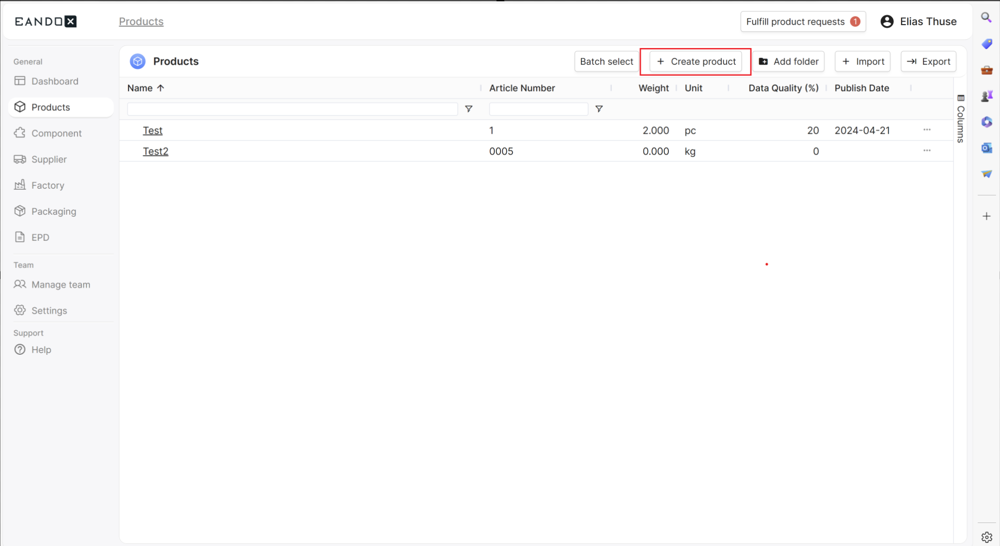

# Creating products
This guide provides step-by-step instructions on how to effectively create a product using our software platform

## Step:1 
Locate the "Product" tab to the left side of your screen. When found simply press it. After that you will be greeted by the "product Menu".

## Step:2
The next step is simple. Press the "+ Create product" button located to the upper mid-right side. Between to the "Batch select" and "Add folder" buttons.

## Step:3
If you pressed the right button you will be greeted by a box of were you can add a name for your product. You may also add the Article number aswell as your functional unit (does not include US-customary units ). 

## Step:4
Confirm the creation of your new product and enjoy.  