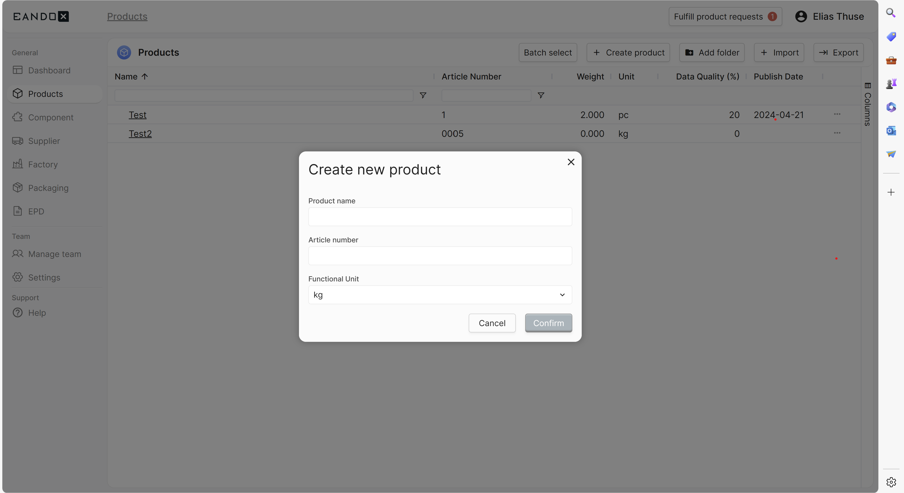

# Creating products

This guide provides step-by-step instructions on how to effectively create a product using our software platform

## Step:1

Locate the "Product" tab to the left side of your screen. When found simply press it. After that you will be greeted by the "product Menu".

## Step:2

The next step is simple. Press the "+ Create product" button located to the upper mid-right side. Between to the "Batch select" and "Add folder" buttons.

## Step:3

You will now be guided to a box where you can do basic customization. When i say that i mean that you can add the name of your product. Please do that. It will make it easier for yourself.

## Step:4

Now you should see that under the bar you just wrote in that it says "Article Number". Please write that now. For more information about that topic please click [Here](Article-Number.md)

## Step:5

Now, after completing the steps before you. You should see the final tab of where it says "Article Number". Please add a messurment of sort to your new product.
More information on the topic of messurment can be found [Here](../../../../functional-units.md)

## Step:6

Confirm the creation of your new product and enjoy .
